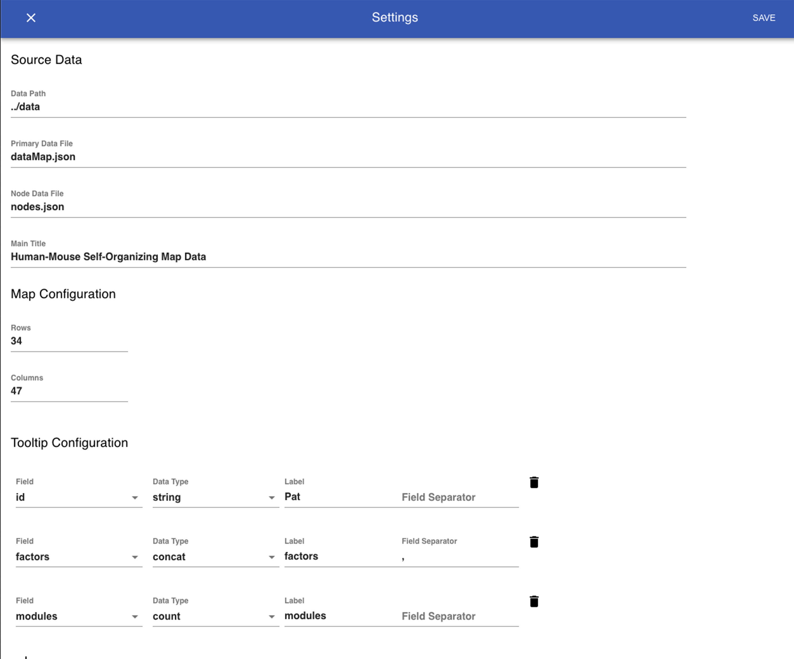

The Settings Panel
==================

The settings panel is primarily used to configure the the Map Display and Data Tables components. It also allows access to various parameters of the underlying dataset, including the locations and names of source files, the main title, and the shape of the map image. The settings panel can be accessed by clicking the gear icon at the upper right corner of the Title Bar.

.. warning::
   Changing the data files and node files through the settings panel is not fully implemented as of version 0.0.1!

Settings for each component are arranged under their respective headings in the settings panel and the display will be updated in realtime. Data Tables and ToolTips can be added and removed by clicking the icons in each section, and the display options for each table/tooltip can be set and modified using the menus and text fields supplied.
